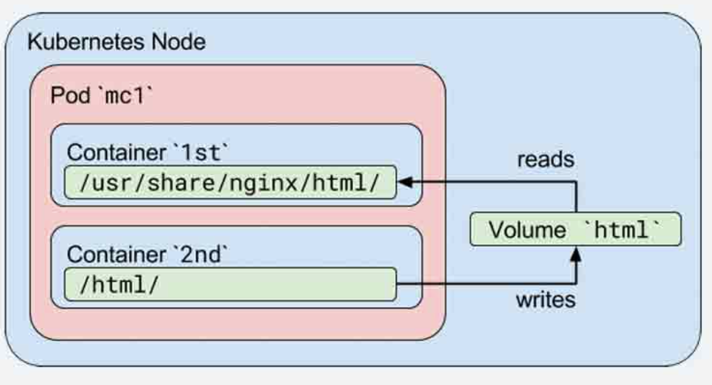
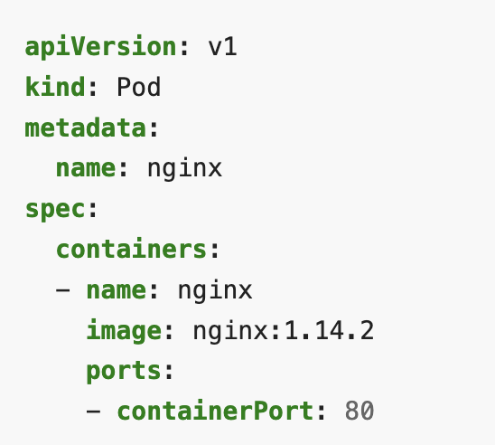
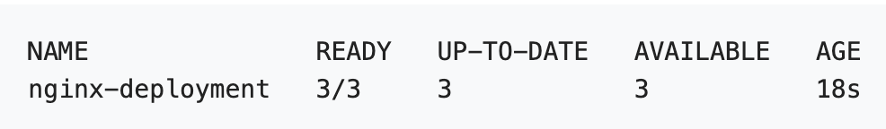
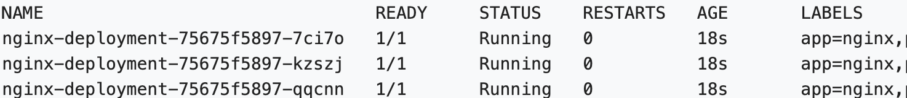
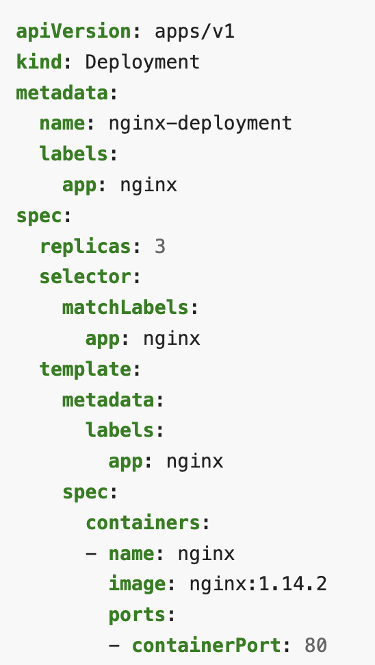
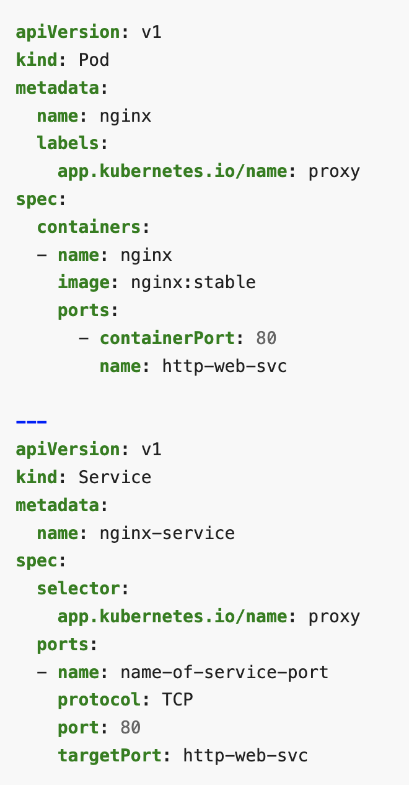
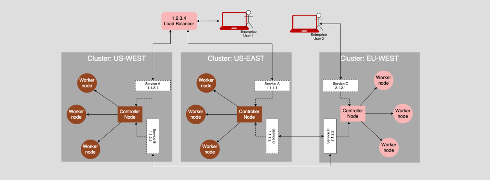
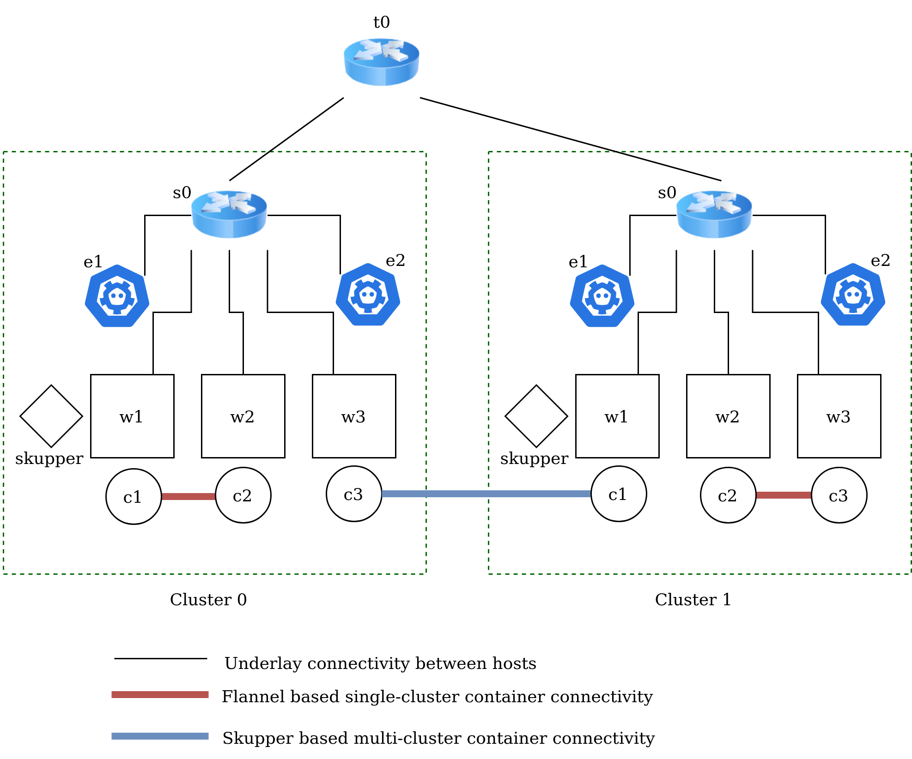
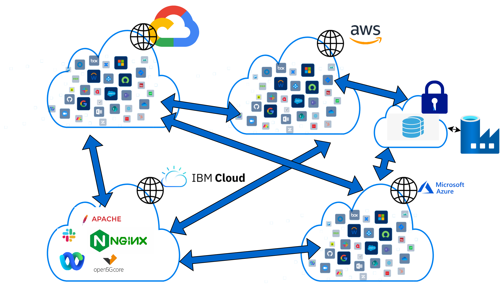

# Cloud Native Networking

Understand the current cloud networking basics.
Have a hands-on experience with a learning tool focused on Networking aspects of Kubernetes
(and multi-cluster networking using Skupper)

---

## Hands On Learning Tool: What it is not 

1. :exclamation: a real Kubernetes setup
2. :exclamation: a single-node k8s runner like minikube, kind

## Hands On Learning Tool: What it is

1. Mininet based simulation
2. Uses as many real components
3. Models reality as close as possible

---

## Refresher: Containers

+ Application executable packaged with its libraries and dependency
+ No separate guest OS like virtual machines
+ Light-weight and portable
+ Isolation through namespace and cgroups
  + Namespace: isolated view of resources like file system, network resources
  + cgroups: Resource limit per process/container  

---

## What is Kubernetes?

+ Docker: Single machine container deployment
+ Kubernetes (k8s): Container Orchestration 
  + Across a cluster of machines
  + Manage automated deployment, scaling


---

## Kubernetes Overview

+ Pods:Application specific logical host.
  - group of containers with shared storage and network resources. 




---


## Kubernetes Overview: Deployment

- Manage replicas and scaling of pods (for a desired state)
- Group of containers with shared storage and network resources. 






---
## Kubernetes Overview

+ Containers in a pod can communicate over localhost
+ Pods identified by a cluster IP.  
+ Service: 
    - Expose an application/pod
    - Handle multiple replica with single end point
    - Support dynamic up/down of pods



---
## Mini demo: k8s hands on :hammer:

Get yourself a temporary k8s instance here:
https://kubernetes.io/docs/tutorials/kubernetes-basics/deploy-app/deploy-interactive/

Follow the instructions here:
https://kubebyexample.com/concept/deployments

---

<!---
## Aside: Kubernetes is a Complex Beast

+ Many (many) layers and pieces
+ Continuously evolving
+ Huge ecosystem: hundreds of competing startups, open-source projects, products

---
-->

## What is the deal with Kubernetes networking?

1. Connect containers running on different workers 
2. Load balance multiple replicas as a single service
3. Expose services by name
4. App net features such as: rate limiting, health checks, blue-green testing

Now, do this across multiple clusters :scream:


---

## Aside: Reality of multi-cluster deployments

Most organization workloads are spanning multiple clusters now.
This is still an unsolved problem!

---

# Rest of the deck is organized as follows

1. Introduce a Kubernetes networking concept
2. Discuss how it works in reality
3. Discuss how we run it in *knetsim*
4. Hands on!

---

# Setup

Either build the image:
```
docker build -t knetsim -f ./Dockerfile .
```

or pull the image:
```
docker pull ghcr.io/IBM/k8s-netsim:master
docker tag k8s-netsim:master knetsim
```

To run the container:
```
docker run -it --privileged --rm --entrypoint bash knetsim
```

---

# Structure

1. Workers and containers :arrow_left:
2. Container-Container communication
3. Service abstraction
4. Multi-cluster communication

---
<!-- footer: C1/4: Workers and Containers, Section A: **Introduction** -->


---

# C1: Workers and containers

+ Kubernetes clusters consist of workers, each running pods
+ Control Plane: Manages workers and pods scheduling, fault-tolerance
    + `kube-apiserver`: REST based front end for k8s frontend
    + `etcd`: highly-available key value store for backing k8s data
+ Node Components:
    + `kubelet`: runs on every node to ensure containers are in running state
    + `kube-proxy`: Maintains network rules on a node.
                    Leverages system packet filtering layer if available 
    + `container runtime`: software for running containers. e.g. `containerd`, `docker`
    

---
<!-- footer: C1/4: Workers and Containers, Section B: **How does it work in reality?** -->

# C1: How does it work?

1. Each worker is setup with a `kubelet` component that manages containers
2. Containers are run using a runtime, like `containerd` or `docker`


---
<!-- footer: C1/4: Workers and Containers, Section C: **How do we do it?** -->

# C1: How do we do it?

1. We use mininet `hosts` to represent each worker.
2. We run network namespaces to represent each container.

---

# What are namespaces?

Kernel namespaces allow isolation of resources.

- user namespace: process can have `root` privilege within its user namespace
- process ID (PID) namespace: Have PIDs in namespace that are independent of other namespaces.
- network namespace: have an independent network stack (with routing rules, IP address)
- mount namespace: have moubt points without effecting host filesystem
- IPC namespace, UTS namespace


---

## Example of pid namespacing


---

## Example of networking namespacing


---

## Mini demo: `ip netns` :hammer:

Can use the `ip netns` command to create network namespaces.

Create a new container to play with:
```
docker run -it --privileged --rm --entrypoint bash knetsim
```

Check the root namespace:
```
ifconfig
```

List namespace:
```
ip netns list
```
(should come up empty)

---

## Creating a new net ns :hammer:

Create it:
```
ip netns add myns
```

It will currently be empty:
```
ip netns exec myns ifconfig
```

Create a new link:
```
ip netns exec myns ip link set lo up
```

---

## Hands on :hammer:

Ping localhost both in the root namespace and the newly created net namespace.
Verify that the counters reported by `ifconfig` are independent.

---

## Cleaning up :hammer:

Delete the ns:
```
ip netns del myns
```

(Delete the container too)

---

# What is mininet?

+ Network Emulator
+ Network of virtual hosts, switch, links on a machine


---
<!-- footer: C1/4: Workers and Containers, Section D: **Hands on** -->

# Our Topology



---

## C1: Hands on 

Run the simulator:
```
docker run -it --privileged --rm knetsim
```

```
*** Creating network
...
<ping commands>
*** Starting CLI:
mininet> 
```

---

## Workers 


+ We have 2 clusters with 3 workers each:
+ `C0w1`, `C0w2` and `C0w3` are workers => mininet hosts

Run commands on workers:
```
mininet> C0w1 ifconfig
```
---

## Exercise :hammer:

1. Ping the workers from each other.

---

## Containers

1. Each worker `w<i>` has a container `c<i>`
2. Exec into containers using this command:

```
mininet> py C0w1.exec_container("c1", "ifconfig")
```

---

## Exercise :hammer:

1. Run a few commands in the container. See that only the network namespace is different from the underlying worker.
2. Create new containers:
```
mininet> py C0w1.create_container("c10")
```
(ignore the error it throws)
3. Delete the new container:
```
mininet> py C0w1.delete_container("c10")
```

---
<!-- footer: Reorientation: end of chapter 1 -->

# Progress so far

1. Workers and containers :heavy_check_mark:
2. Container-Container communication :arrow_left:
3. Service abstraction
4. Multi-cluster communication

---
<!-- footer: C2/4: Container-Container, Section A: **Introduction** -->

## C2: Container-container communication

+ For the moment, assume 2 services both have one replicas each
+ 2 pods need to communicate
+ Pod: group of containers with shared storage and network resources. 


---
<!-- footer: C2/4: Container-Container, Section B: **How does it work in reality?** -->

## C2: How does it work?

In brief:
+ The network namespace of the container is assigned an interface (eg eth0)
+ A pod is assigned an IP
+ Packets from one pod needs to be routed to another pod


---

## C2: Pods on the same host

+ Docker also needs the same setup
+ Routing is much easier with a L2 bridge

**But what about pods across 2 workers?**


---

## C2: Need for CNI

+ Many different ways:
  - Tunnel overlays like VXLAN (underlying network is unaware)
  - Plain routing like BGP
  
+ Challenges:
  - Different techniques for different clusters
  - Pods keep changing


---

## CNI: Container Networking Interface


+ Standard interface to manage container networking
+ Different "plugins" that conform to the spec


---

## Some CNI plugins

Out of the box plugins: bridge, ipvlan, macvlan, dhcp
A lot of other plugins:

![w:200](data:image/jpeg;base64,/9j/4AAQSkZJRgABAQAAAQABAAD/2wCEAAoHCBEREhIREREYEhgYERoYHBgYGRIVEhoYGBUZGRoaGBgcIS4lHSErHxwcJjgnKy8xNTU1GiQ7QDs0Py40NTEBDAwMEA8QHRISHz8rJSw3NT8xNzc/NjE9PzoxNzQ2PTE/NDQ2NDE0PTQ0NjE0NDQ0NDQxNDQ0PzQ0NDE0NDExMf/AABEIAIkBbwMBIgACEQEDEQH/xAAcAAEAAQUBAQAAAAAAAAAAAAAACAEEBQYHAgP/xABIEAACAQICBQYKBQoGAwEAAAABAgADBAURBgcSITETQVFxc7IiMjQ1YXJ0gZGxM0JSobMUFRckU4KSk8HRJWKEosLSFiNjVP/EABkBAQEBAQEBAAAAAAAAAAAAAAABBAUCA//EACYRAQEAAgIBAgUFAAAAAAAAAAABAgMREiEEMRNBUWGxFCIyccH/2gAMAwEAAhEDEQA/AOzREQEREBERAREQEREBERAREQEREBERAREQEREBERAREQEREBERAREQEREBERAREQEREBERAREQEREBERAREpAGUlpiOIU7dNuocugc5PQBNLxHSGvWJCnk06F8b3tPrq0ZbPb2fDbvx1+/u3mrdU08Z1XrIE+P5zt/2yfxLOasSd5OfXvnkiaf0f1rN+tvyjq6MCAQcwRmCOE9S0wv6Cj2Sd0S7mG+Lw3y8zlWIiFIiICIiAiIgIiICIiAiIgIiICIiAiIgIiICIiAiIgIiICIiAiIgIiICIiAiIgUnwu7haaM7HIKMzPvNV00uiFSkD4x2m6hw+/5T3rw75SPntz6Y2tbxG+au5dvcOZRzAT3huGVLhtlBkBxY+KP7n0S3tqDVHRF4swA/vNsxS8WxopQo5bRHHo6WPpznS2Z9OMMJ5czXj35zzviPH5msbcDl6m0f8zZf7RKl8J6E+DzUajsxLMxYniTvM8kzz8DK/yyr18eT+OM4dTtyuwmx4uyMsuGWW77p9paYX9BR7JO6Jdmc2+9dTHzIrERIrQtYenP5vC29uFe4ddrM70prwDMOcnmE5JX0kxO5c53VxUY79mmX3dSINwlNMr1q+IXdRjn/wC5lHoVPBA+6dp1a4LTtcPoOFHKVqYqu2Q2iXGYXPoAyHuhXNtCMYxVsQtrZriuFds2SqHI5NQWY5OM+bLP0zp+sXFa9nh9SvbvsOKlNQ2QbINUVTuPoM2bk1zDbIzHPkM/jNM1v+aavbUfxlhGnaCaaYjdYhQoV7jbRg2a7CLnkuY3gTs8jxqx8623U/cMkPC1WIiEIiICIiAiIgIiICIiAiIgIiICIiAiIgIiICIiBb3jlabsu4hGI6wMxOAW2sXFy1PO6BBdARydPgWAPNO+4j9DV7N+6ZFa18an66d5YWJYUzmAfQPlPc8UvFX1R8p7hFIzieKr7Ks3QCfgIKqWE0XS9s7nLopqPvJmGqV3Ys2028k8W5znLvFSSaRJz/V0+RnQ1aPh5y2ubu3zZjZIutFEBulz+qjMOvcP6z7aRWlepcsy0mZQAAQCRkBzSwwk5NVy3fqz/wDGWXKP9tv4mn16W7blPo+PaTXMb9WcwHBWernXpsqqueTAgFsxkP6zbhYW/wCyp/wr/ac05Rvtt/E0co322/iaeNmjPO89n0178MJx1dUQAAAbgOjhPcwWiSEW4YknaYneSd3ATOznZTrlY6OGXbGVWUlZw/WHXxP8411oG75PwNkU1qmn4gzy2Rlxke2j435TddvU77SSOi3kNp7NT7gkZKm1tNt57WZz2s9rPPfnnz5zL0fzlsrsLdbOyNnZWuU2ct2zkMsoVJrOaTrf801e2o/jLLLVD+VchdflQqhuXXLlQ4bLYHi7XNnL3W/5pq9tR/GWEcu1Y+dbbqfuGSHkeNWPnW26n7hkh4WqyhM0fT/ThsMKUqdAvUdSys/g0QAcjvG8n0Tkt7j+KYk5Q1KtXM+JSDKg9ycB1mESHfErdTk1emp6C6A/OfajXRxmjKw6VIYfESOX/gmKMNo4e59bky5+LTH0Li8w+rkjVLWon1fCX4odxEKlHE0rV5pj+cqTJVAWvTA2wNwdTuDqObfxHMZusIpEjzrAxO5TEr1UuKiAPkAruFHgLwAM3fGNY9O1s7ZKGVa4e3QnMkpTzQb3PO3+X4wOmVKqoM2YKOkkAfEz4UsQoOdla1Nj0B0J+AMjvVo4virGqUuLnPnAK0v3QSFy6s5ir/B7m0Ycvbvbk8CV2fg67s/fCpUROJauNOa1KtTtLuoalJyER3Ob03+qCx4qeG/gcp22EUich1zXtalc2gp1Xpg0XJCsygnbHHKe9ENOKdlhRe4qNWqivUVELFqj5naGZPBRnxgdaLAbzulr+crfPZ5enn0baZ/DOcAxHHMVxioQoqOue6lRDCkvoZhlmfWMxOIaM3tsvKV7KpTUby5VSB6Syk5dZheEnwwO8b56kcNE9MrrDqinlGqUSfDpsSw2ecpnvDCSGsrpK1NKtNtpXUMp6QwzEIuYic/0/wBYC2BNtbBalxlvJ3pTz4bQ5z6IG91aqoM2YKOkkAfEz4JiNuxyWvTY9AdCfhnI5/4litQ5ctdvzgE8moPNlmFUeiXVfV9ilFeU/JDu/ZshcDqBB+EKkbKyO+jOnF9h7hHZ61MNk1KoTtqBx2C29WHQZ3rCcRpXVGncUW2kdcwef0g9BB3Qj6Yj9DV7N+6ZFa18an66d5ZKnEfoavZv3TIrWvjU/XTvLCxLCl4q+qPlPc8UvFX1R8p7hFJb3io1Nlc7KspUnPLcd3GXE1zTOtlRVPtOPgu+etePbKR42ZdcbXw/8fsf23+9Zjsaw4tUXkSjKtNVBLrnuz45mYLKMp08dOcvPbly8tuOU4mPDO4NhxWo3LMiq1JlJDoT4WXDI+ifDEKVrRqPT2Kj7OW/bUA5jPomIyl/jH079S90R0vfzf8AE7Tp4nz/ALX2FWdrcMykPT2V2sy6kcQOj0zKfmCx/bH+NZrlj9HddkPxFltbUuUqIn2nA+JnnLDK22ZWSPeOckkuMvLpdlbLSRaaeKoyGe8y5nld2Qnqcy3m8upJxOFYiIVFfG/Kbr2ip32kkdFvIbT2an3BI3Y35Tc+0VO+0kjot5DaezU+4IVl5pGt/wA01e2o/jLN3mka3/NNXtqP4ywjl2rHzrbdT9wyQ8jxqx8623U/cMkPC1g9JtGbbEUSncA5JUDgqcm6CufQRxl9heF29qgp29JaSjmUAE+kniT1y/mtY7prh9kStWuGcfUQbdT3heHvhGyTQ9bGCJXsXuAo5S3G2G5ygPhqekZffMFiGuJRut7Mnf41VwnvAUH5ia1jGsm/vKVW3NOkqVKbI4RXZgrDI5kndu54VY6ub82+J2pB3OxpN0bLqTv94EkZIw6Ln9es/aU70k9BUcNYXnS97UdxZtOrXQSncot9dgOhY7FL6rbLEbVTpGY3L8Zq2sLzpe9qO4s7Dqt81Wv7/wCI0Da6dNVAVQFAGQAAAA9AEsMdwqleW9S3qqGV0IHSrZbmB5iDlMnEIidUVqbsufhpUIz/AMyORn8RnJR4Pccrb0KnHbpK3xUGRq0hGV5dgf8A6KneMkNoT5ssfZKfcELXNdd/lVn2D98TXtAdD/znVcu2xRpkbeR8Nid4RejhvM2HXf5VZ9g/fEyOo/xL3tE7pgdKw7D6NtTWlQprTRRkFUZfHpPpMuKlNXBVgGBGRB3gg8QRPpEIjTprhK2WIXFugyUMHUdCVBmB7t86/qkuzUwukrHM06j0+pQ5Kj3Age6c91wj/E+u3T/lNz1KeQVvbH7iQratLsZFjZ1rniyrkg6Xbco+O/3SP2A4ZVxK8SjtkvVcu7neQvjO/wDb3Tpmu+6K29pSHB6zMf3E3d6abq30gtMOr1q11t5tTVE2EL/WJfPo4LA7ng+E0LOktC3QIijm4k85Y85PTL+aD+ljC/8A7fymj9LGF/8A2/lNCMRri0dTk1xCmoV1cJUy3bStuVj6Q2Q6mltqTxVg1xZMSVyFVBzAk7Lgde4/GffS/WHh15Y3NtT5XbemQm1TKrtZ5jM801fVLUIxWkAdzUagPuUEQru2I/Q1ezfumRWtPGp+uneWSpxD6Gr2bd0yK1p41P107ywRLCl4q+qPlPc8UvFX1R8p7hFJZX2G0q+zyq7WWeW9hx6jL2IlsvMSyWcVhv8Axy0/Zf7n/vNdxtLe2q8mtsrDZBzL1M9/vm9TQtLvKj6i/wBZq9Plc8+Layepxxxw5ke8ES3uavJtbqo2C2YeoTuI6T6ZZ6QAC5qgcAQP9ol1oh5SOzf5rLbSLyqt6w7omnHxus+zLl50y/ddaK261Xqo42lNLeN4+sp5ps9DAramyutPJlOYO05yPUTNe0K+mqdl/wAhN2mX1OWU2WStnpscbhLYCViJmaiIiBFfGvKbr2ip32kkdFvIbT2an3BI3Y15Tde0VO+0kjot5DaezU+4IVl5pGt/zTV7aj+Ms3eaRrf801e2o/jLCOXasfOtt1P3JIeR41Y+dbbqfuGSHha5DrQ02qrUbD7RzTC7qtRT4ZJH0an6u47zxmuaF6BVsSHL1HNGhtEbWW1UqEHI7GfNnu2jNYxt3a5u2bexuKvHjmHYD+kkjosKYsbQUstj8nTZy4ZbIgYrC9XmF24H6sKrfaqk1D8D4I9wn30vs6VPDL0JTRMrWplsqq/VPRNmmq6w8To0MPuVquFapRemi/WZmUgAD+vNCOE6L+W2ntFPvST8jBov5bZ+0J3pJ+FqOGsPzpedqO4s7Dqt81Wv7/4jTj2sLzpe9qO4s7Dqt81Wv7/4jQNviIhEXdIvLLv2ip3jJC6EebLH2Sn3BI9aReWXftFTvGSF0I82WPslPuCFrmuu/wAqs+wfviZHUd4l72id0zHa7/KrPsH74mR1HeJe9ondMDq0REI4Nrh85f6dPm03PUp5BW9rbuU5pmuHzl/p0+bTc9SnkFb2tu5ThWO140jydlUy3Co6n0ZoCPlNS1c6N2uJVq1K5Z1KU1ddhghPhENnuOf1Z1fWTgzXmH1FQbT0yKqDnJTPMDrUmcS0Qxw4feUrnIlAdlwOJRtzbukccvRA6z+iTDPt3H8xf+sfokwz7dx/MH/WbzaXKVUWpTYOjqGVgcwQeiXEI59+iTDPt3H8wf8AWZHR/V/ZWFwtzRaqXVWUbbhlyYZHdkJuEoIFtiH0NXs27pkV7Txqfr0++JKjEfoavZv3TIrWnjU/XTvLCxLCl4q+qPlPU80vFX1R8p7hCIiB5mhaWn9ZPqLN+mhaTYdUp1GqsS6sePR/lM0+ls+J5ZfVy3DwaI+Ujsm+ay20h8qrdY7omV0OtCC9dtwC7IP3sfumAxK45StUcfWckdXAfKa8P3brZ8ox5/t0yX51mtCvpqnZf8hN2E1HQiic6z5bvBUfM/0m3zF6m87K3emnGuERE+DQREQIrY2f1m69oqd9pJLRbyG09mp9wT41dEsOZmZrKixYkklFzJJzJMy9GitNVRAFVVAAG4AAZACFfaazrBw5rrDbmmi7TBQ6jpZCGA+6bNKQiLeBYq9ncUrqmAzI2eydysCCCp5xxkgdCdIjiVr+UmmKbCoyFQxYArlzkDmPRLbFNXuGXLtUegUZjmTTZqYJ6SBumXwHAbbD6RpWyFFLbRzJYliMsyTA45rR0ZqWty92qk0KzbW0OFOoeKt0A8R75Z6K6f3eH0+RCLXpAkqjEqUzOZCOAd2eZyIPGd/rUVdSjqGUjIqQCpHQQZqd7q2wqqxb8nNMk5/+t2QfDgIVo+Ia4LplIo2tOkcvHd2fL93ID75jMK0XxLGXe7uqjqmyx5SoMmbIZhaSbsl9O4dc6rheguGWrB6dqrMODPnUYekbW4H0zZsoEYtGN19aA8RdID1hsjJPTC09FsPVxUWzpK4baDBFDBs888+mZuERv1hn/FL3tR3FnYdV3mq1/f8AxGmVu9GLCs7VKtpSqOxzLMilicst5mQsrOnQRaVGmtNF4KoyUZnM5DrhV1ERCIuaRH9cu/aH7xkhdCPNtj7LT7gla2imHOzO9lRZmJJJRSSTxJMy1vQSmqoihFVQqqNygDgAIVx7Xef1qz7B++JkdRx8C97RO6Z0TEcEtLoq1zb06xUZKXUMQDvyGc94bhFtahhbUEohjmdhQuZHDPKEZCIiBwbXCf8AEv8ATp82m56lPIK3tbdynNxxDR+yuX5SvbU6rZZbTKGOQ5szPvh2G0LZTTt6SUlLbRVAFXM5DPIdQhV6ROMawdX1Sm73dihqIxLPSUZujHeWQc6njlxE7RKQiNmjemF7h2a0KgZM99KoCyZ578hmCh6j7puS64q2z4Vim16KrbPcznRMX0Sw+7O1XtUZvtAbL+8rln75hV1XYUG2uTqdXKPs/CFc3xvWZiNyDTRktVbdlTzNQ57sttt/wAM6bqxqXhsFW7puhViEZ8w70zvBYHeMs8t+85TL4TorYWh2re1RG+1ltP8AxNmRM3lCPnXp7Ssv2lI+IykWr+ze2rVKDgq9KoV38c1bwW94yPvkqpr2PaIWN+wa4ohnAy21JWpl0Ejj74GD1d6bVMSapQq0lpvTpKwZWJ2xnssSCN2/Lp4zfZruj2h1lh7tUtkYMy7JZmZzs555b/TNigIiIFJ8q1FXUo6hlIyIPCfaUhLOWtaT1WoUFpUk2UbwSRwUdHvmmqpJAAzJOQHPnOpVqSupVgGBGRB4TC4do5To1TUz2gPFB+r19M16d+OGFlnn8se70+WWcs9vwvcEseQooh8bxm9Y8f7TJSglZlttvNa8cZjJIrERI9EREBERARKSsBERAREQEREBERAREQEREBERAREQEREBEShgJWUiBWJSVgIiICUiICVlJWAiIgIiICIiAiIgIiICIiAiIgIiICIiAiIgIiICIiAiIgIiICIiAiIgIiICIlICIlYFJWJSAiIgIiVgUlYiB//Z)
![w:200](data:image/png;base64,iVBORw0KGgoAAAANSUhEUgAAAbEAAAB0CAMAAAA8XPwwAAAB6VBMVEX39/cAAAD////3lB77+/t2TCk+Pj4TExOwsLCfn58WP3UkJCTJyclISEidnZ3f39+pqakfHx/n5+ft7e18ksbPz8+Xl5fY2NiKnsx1jcJtib8pKSllhL2bqtSDmcpef7r4kT1tbW2YqNNXebems9i/v78EVp9kZGT3ijy2weH0dyo2NjZJcbHAyuWksdj4lD0qZql4eHj2hDxPT0/J0OeMjIxnZ2f1gSb1eTshYqdXOSCDg4PgiB9ZWVn3kh9iOROgYybx9f8kGhF9UCsEIE31ezuvaxprRifj6POKVBFMMh3BdRsRAAAwIRTxkR9CLBrGYyY3HwBQKwAeJjP5nj7zaDoNLl8AAB45IA+LRRfWbiQaDAA1GQBvNxiqrbgGFB28wtN2SRPTgSB8gIsZAABLLw6XnKpnbXtaMwCnZRlQVmObpbwpGQY3O0Vwd4oiAAArJiFIIwCERwBZRC5HPzeGka5JT19cZXx2g6UzPE+zZCJfcJVDU3JAGwBTZIgAHjAnMUN8Y0pWJgAqQGIAAA9KaJsuDgA6U307ABCeRSnVgDijJyhQBhbUYjbcSjVmIB3jkzu8cTIAGCnvPTYTMVF9Fh8EGDnGQDH1bgscUYjBsaT81MD2k1ili3j5upq2Wy8AAScAV6U0AA4+HcYDAAAUF0lEQVR4nO2djV8TV9bHc24GEgRMyDSJbbSbuKIx0UYSgTQEcIkQCZJAAUXR0tBSRVHX3Uerj3RlF9C+t+tSW7bPPrb7l+65d14yk8yQGQyVrvf3Ud7mnsnMfHPOPffMzR2Hg4uLi4uLi4uLi4uLi4uLi4uLi4uLi4uLi4uLi4uLi4urrgSU8QZCiPEWrlcoQWjzdooGZIjD2+9q95JXcExc20jwhADV72FkBFn4I/ECLBdmoZ8j21sSQ3ezTufYJHRjCHR4/G2ooA8dLAWlplxTLg8tHNleEglA0Uk1AvE46JTPNaFKs8C7sr0kMX5pgBFzZucoJlc8Hg+58Ic5iqspP1vIQydHtnck+OFyrFdB1n7uD7KaJWBUufNdPCzuGQmk+4rTOaB4GUT+cI4pAhIs9rUAHp7j7w0JxJ+Cq+hhY4NLDNkYvM+AvQ95xmocKLkMZpJBzmwPiHj6sb9aGhjI4rdBhmx0/txpVEeJeRft2Ar4nfZvEZGHxlcsQehGEMdggaaJqLJzbGlwWckTXeOZfIn+MIQJPnx4DX/ycjd7pSJBHDjfOP0B4GCsLGNaHy8gp7nswtjI6KLCDomd//DcB80AzT7uZq9OpAX96P1zpz/+KOssMjrjmaYcxsJchjKkWjgzxEZlTbnla6dPn/sYf+7kyF6RBEeEOhjqwytFZ9FFu6ucnMznYcypaGEQIJNrmmRNT98C6LMQGQVaPzaXSdHZgqmhpVnjbQ7QdP82T8TsJLa12vb8zS+MiDHuY0bhw7vO7CxLL5pUYiPOirKLUMoVbp2WGmPS6KjzggLxuQOR9lCHq1Yd8fZIwG1UdJZNRXegpzlkYOkKtfcYWopGr+NyQWqbI+wCY5s23d4J8Xv7+k2Oprm/y9smGLwt8G+d+7tS8VbDl0C7Pq/fyG57Cb5WcN2UIFy7PgZD+ZyGWBMsObUagblCq9T49E3szMRtkZG2dqin9jbDQybB/nqWOMioPhWXccvmbQ4xYrJ3LTHB0V33PKCv5lqQ4LH6ZtC9/TWskeBxQesHp09KxDAgUl7j4yqx9QqxBZpJFpdBJnYSExWIb/NyLNpaUMRgF7RntXCyemSmxNrNz98KMeI32W+1if5wSMCSVY3d9hJ8HRA/efokExLLUGCZfGEol8/kKz5WHBsrZiG7RMvEi/DBSbn9By6ImwdGoa6XyDpWswuy35pln+5cd4mY4Ld4HvpISiz4pZFdHWBiCEInFX0sAWvKDJUybE8FiViWpY+L2fUyJbaksTjuMr8aNo54f3V4a7NqqStL7w4xQeywfCKi5mA6LVuBSzQ8NkOloOO4evmhJHdhuXGMd10YhMdzSCwL0NrVgztekHqyAtxQkd00Dmr0iIPWjxh8+n2IIcuWu0+MdFk/j4jmrWctkkrqsxoX6cHcVHidvHFe6bwK4ArS3LMHMtiPLeLIC4UuU6T14QIO0m5qkRnf47RzolUdkuC1bunVJgi7QYx29NalduuC24ZVzVvW9GhxrzePK7oJapY4BAjMh5TiyzBSBC8hIua3XTRClmnZY/mWanX8tkkYFuP1j1OV/pISqx0gKqVhvTvEbF16t+qZPXbMKnbbSvAA3K5c+htPZvNKSt9O+YQE0j0HY0XwEIzJfhKEM84iZNgo7abGDloNEka6cxvSBXJbsHfbx0ifnfNQwxux3vlRdVsKi/hW1vjKkflCZjYjEZtLEZICF0a2Sey85oLUGTuR2IhzDKTbmtcqhsdbweAmp/UEi8mjvfD24tBuE7MyplJVcXk7VmBtwhOdHXXk+JEj0v/j9+4UmnJ5ycsy6FYOt0h8QOuKYzcIaWsj+GajeQeLnIUORCzbHr9nFBftpEpQNV61k7NoewDBZ9Imbn4VBLPopRJL2TmaEKlzKCZqt0CMJq236UWXdPz2nVnFxZDIvB97sbY/Yg5C08NrDpZ5ZFViGThS0fFPDIoKuvDf4TaSNvvXZul699xfa6hLTIK6bBFFdEMDj2A6Y7ZiIuhiWAvR2hBt2SZieCKaFi6FmO5d5zU0i2haxC0QQwK3tJf9xjIOmhVkufyToeblu5jmz7IB9J/+/D93l6T70nK58abG9ogLamae6vK9ViLUimi90G1KzFNjS0RTYsy8ilj9S1HV6+hzXx2xFsMT0bqpQkx3DqKhmbZKYIEYzQzuaa/6/VldPbEpR++2NLnKTr1Agqq3vQ2h6jGgnpjRZROsEashgpnJ7hLbvx0xoxPR9nSGxAxzd10RK1SfGPZKt468U9GR+8sysYKmFFyA66OjrHo/0BuL9TqLS4uuHPOxezrjqRon+9WI1XSh/6XEaFp17x2tPllWKLmGMnT6b1OmMNfa1fdhZP36yMJADDWxCKNZVivOwyGd8e2azp0TazAx0gK33jmk0TsPQBmN5fLjUCrMYXANgasVz6UVd3l14hLcnRhwOs/Q4mMG9MaHOqonnnJiDSYmxOHBIZ3uqcTYZAFaIyPyKFgkIq1CXI6x2aejUGqafag3PvRJdQGeE2ssMXpWh/U6tCqlHphx5Ep4aGLAR4ivGQd3IiFCwONrp8ikfBHg0SG0OFQxvld9WJxYY4lh3nG/mtgj5mSloaEhDIjNHSnCpih0Bdh0BNLVEQf4dHZxkU5lLFPc9x4c0CC7VXU2nFhjiQkheFBF7PCBKXqzJY+CgEMUcIhNWfV56VeRjihFuJTNLtC5VfDJ4cMP8HUeVawfQf/L+Jj3t0xMW7jeJWJ0fwcOH9ALGWTk4XGQkH6PNNlHIkZIELu1iDw4Yy6GQbSE2BXj6rBYn5hDDKrya4dzvzViDk/lRJSjbTgxLwbFA9U6fF9KPhixtpCeGKNYlmfnPMDGU6Wm3CxUrKeq7gfXJ+bQFAB0f/6tERNqT6TRxMgx+KQGGL3q0qeOznchov1xoULM4fLSzHFESjyY7X3aFlZU2/v6G6lWiJnoN0es7jk0wMdC1E0MkeVZnZdi8rJbz4yYG9zYl8WXJQ+7z5o+ohXGyYqTVXVkOyImv0+riNXo9SNGa4pvG2uKTc4pQR+mHeIx6HL3d7m7oAd/a5tnE7pH0cOkprTXG4S/yL+9/UBfW9wRMZ/HR6W7UdPmq5GuLv56EGuDKRNiiKzERtAuOhwTOgN9fQHqap39sEhneYzDitoSGw4uP1R+fWNef1tyB8REO3cyXy9ibnhozAs9ZZxNu8/jXpq73X6fKHo6WyIAV8aQVxlciyrrFdqRLcIbFdbBlyTmsD6F6jUjRvajp7xhpLcfXl/IILPS3Gx2bPS8sr/3luiSEYP49/+NwSO5LevIBuHR24qpfhjMiTWSWB+sGAJ74y1YQE/KlADGR8cwChZxxEx7r+wI4porZBacsaurKjHMUgbPq3t6qDtVTqyhxI7BX4yJrXxKP7Y+kslk2EcylxfL5fIgmxE8VMhkRpFh7wS8qdDNsI5MtdVNCOLEGkoshcTeNNLjF6w8XxwZzMBkoTQ+PjQ3NzReKswN5TNnqLP1xmJzK7ItIza5KpsisT5OTD2IxhMzBPYIsgO9vWx1iMXUX9+7e/c9prt3/wxnWLkDN/ZeeiY1lnxsckox5sS0B/ErEVv7W0xezGMM6L0Wf+c/UW0egfQ9ked59MYuw1ucWD01mlg/EnvLQI+XMOoxZtcj+k9/itLHJAZisd7YkxVq/KaUeUyuyracmO4gGkwsAitGwA7CZbpkzgD9PIS/6gO7/aOM2ABCuzTFWq/QD1YMLq8p1jzz0B6ETWJ1Zr+RbiR2EAlJX9TvTz+VPcw5MlX9iWs3SFERvWwCGKH1EhuPqXt6qL/J9ZrXPHSVNNFguqKt+YqkBdYOGmiz3NsbY4lHuaf6Q/GitEwE3R6DDWy8woLiIvuZaVU/sXcnPiZK0l1yv1gj3QzpPUrM3gdFoLlOlaoTVo2IPR6RAp+zeMVds47BurLRGbuycvDgBjAXm5xSrRtQpZJN69xt+S3U7vV3hOorVYeYH+YNgP1Oyi7oeKymG1M6MuZnl9aw7RAFhkFRtXbpwvVrfn/MQexF+DpLIArYYfyuVhvns8q6HeCpIdanzufuffF4gy2RmR+crOxnA5pt3m3RdpW6W2u7Scz4NV/yHrRmp4Zm9VVvxWwSh41aYk8niwqxdV8NscB7CrGBCQC2fAR1sYo19Ni7By14AhXpAuouEhM1r6kpXL/czBy3ZqfKPi0vDSHJXycUkC5YMyCmMqlLjK1JMDi4PF+xXoWATWKvYvab1lTzDmv4XCqbqUe8XuwW3LBaS2zteoVYbVTsVrc6L7MZPIODBa2nzuvfJ3uVmKZ7iTSKmMF8RZuf3K+79jJ9A/y+RmtqT1WEYA2xnj+pxGIsscfMfq1ivFH1gaTXnpid0aWFpZdJMzytIbZZIfaks4bYfGVJsWHID6JgVYtbt5YFJ2YnLtauGVQrHEOv1hCrREXzETTrx4ZhkQKbYr71dA31dKNquiInRlNya6tcBKwMGSj/jd+f0ElLbGxerE48PlI3DlwGGhIR2Ik1zQv7uY/piWHWHww018HV77W45DJJwdqJKj29W1SpPAlUEdOss4i5Ig7EVmkkhM8+/yKRSEe/+PIrutyzrRH0fz8xaaQmBtmzVAzk9zisP20KL9d8NbHKCJreH9Nni1131E04goZlynsevvo6EQ2H6b9E+JtvwaVxM06sst1cBnszVwieVhNbX6hgKevi4n6lF6OFxdhVmN84sQHweTgZRV7T0/glmkz/oF06mBNrtIi31skej1aIOa9DW8XD5NWCB1jxPsYCKsDX4eFENDGdSM4Mz1Bu098NVcZkVatDGEl7Ze0Qs1UJrioFWCG2zeoQXsMTMVgdYldU62Rrk0UNslFo76RluGA3qCXi3gFENgHYdgq+SEajiUQiORyOphPD4eT0dOK7yhJVuhVYXC1G0g4xlUST3TjSEyPa8FE7796v3c7MdcS69a+prR1JxKR7Va06YtqIpSPWY3gimuzCZUzs5UMiPRK8pKeqwqJm4W0nmwLM9ESTdMR6MSg+RrhwJokOlkBO0WQSnS0dTiamw39XB4M7WuXIdG2gDuWozUaljm3NjcWICWbLTinvoZ2tclR1rSMGTS0l9ToJ7bB54pRWJzavO/XKjo0taP2Ozn67DFsnTsFn6UQ4nJhJJ6KoMP4bjoYxQl5VotiOVhKjq0wbSq27ma0KJxOzdYuDEau/kpiNpQPN7nMZVqzsP3qPXtMtHbFTW9TJsosqL+nxLWdUzxsdQWRXn5069RReILB0MhweTqKLIbJ/RDFITk9PKE62o9X69iSxna3WtxvE6HSPeT2xU5vLRWfWNbZ0hiqXmWOcBi/1ShpYHnFiL4aYn52focSimHVEo5TYTDRNuU0nvorL5UWx3thRK3k5vb1IzF54N17ZslHEHI5mWK1CdrHsLE4q64llJiXPuhqTBVn8v4nN4PtoOEnjYGKYuVgYo2OSDsumP1fSRVvvTXkW1p4k5rOztqXxYvINI0Yn/KxVx8VRZ1l5qERJ/tzzrAxsAmKx5Wes1ZloOD09HE4ko4wYxsfoTBiH0xgW5beZrTTAp9jsPWJ21hSHY8YUGudjNF/cOvWurFPvbu07+xxGl+bkpcTGF9m4uQwysUuDseX1s2cvbO2DH6bTiCidmGF5BwZFmnwkMCx+p85atHEXVkmb9iQxOyuDmyzQ3Dhi7P2zpRBDXqjnsCivd1RuiuBArHg+9cWPErHZq3PrtMnZTZhI00wxPJOmw7FwkhFLJzDf/07T+VrNstQPUO9NYjaeUGACoYHE2AHLyPahLlAe63RCfbmc+yebV1qOEPLT//34I1IDuEi3X9i3CT9gF4a91z+i0WGMhTPD6GE4IMOO7IvKzGCrTwGp3M/bm8QcxCIy06d5NJIYWyd3SwEmM7s4nvuXn806EmBhTipW/fT/P76A54wXNoIXGAOj0YSaKeL3aHIafWxCeyRWnrST0pynaS+vrgVYh5i1KyvLMjGHIFqI8Ns8MceQWPWDNCwTcxyTkO1TdeEs/EsqmGE8iP2tRZ7d9dOd5wwXFXw+nKSUZpLD6GrJNC3hJ5I0Kv5df6r0kVRd/c2GSh3r29/p0N1uEFPGTdW4abIrmajYbrzZ2IaFb6Evbrg1pJ/dREjQ291jdnSRbq9/u4ecke7aF4lbW+LeCJmA77I12otV9LyZFe4d/tCVF1fB7RAps571SgP4bCaJyNJJCguHYok09mTJKCK7Ol+1Bpy9B62ZtbO4fdvXMjayemQ7eH7d9qe1U2AOKf3YfPfdo1pk0L+/JZCCZ88uPnsG8e6WQAQuarZvwjczM+loOir5WHg4MR2lBfxEwizB5WqkaJLv2nr36FGNn539+eLPZ5Uw+fziz88vaIAd3YLv08PJsNyNUedK4lcMjZ/Xn8jF1QARD/bom0eptMHRUFus2Tx8TWNikt3SRA9LpKO0L/tmuwcgcjVQgoPWlPYdVWUAbquy9QI2vjODeQeOxsKYJSbSw+hl+O2rutORuRol4m8GmNcwM9c+5NXfAp8lpzHxCNOMEXlFh8Pp5Lc7Tlm57Esgbhx/uuow++XoJvLq6KRTP/6dDtOKRzIcprNzMDhmoI972K8p4mCPG93ch1xMcO17THm5aWZKH9TzghY7kpghotI/nLf4TCauxokI7mYF2i+/VMD9Qn/bYrgg1SmPJEiwFT76ciadTkanwzNf/ps/hP2VSCDBbqk493iTpvFSx4UDsGfsj60BX2XkJwhe2vTbb7//lq45Fqj3OG+u3REO7YMthlX3Y15f1UidkLZuVjls7uu0/+xwroaJ1mM89PHuciU9lOpq6fQZlmIEVqF5uZoLV0NUXUazP72Oi4uLi4uLi4uLi2sX9B/L3jc6aN9ouAAAAABJRU5ErkJggg==)

---

## Plugin Classification

+ Interface plugins: create interface for containers
+ IP Address Management (IPAM) plugins: allocate IP address for a container
+ Meta plugins: portmap, firewall etc

Can chain any number of plugins one after another.

---

## Spec

Spec: https://www.cni.dev/docs/spec/

A plugin must be called with the following env variables:
+ COMMAND: ADD, DEL, CHECK, VERSION
+ CONTAINERID: id of the container
+ NETNS: path to the net namespace of the container (eg. /run/netns/namespace1)
+ IFNAME: name of intf to create inside the container
+ ARGS: extra args
+ PATH: where to search for the plugin 

---

## Example configuration

```
{
    "cniVersion": "1.0.0",
    "name": "dbnet",
    "type": "bridge",
    "bridge": "cni0",
    "keyA": ["some more", "plugin specific", "configuration"],
    "ipam": {
        "type": "host-local",
        "subnet": "10.1.0.0/16",
        "gateway": "10.1.0.1"
    },
    "dns": {
        "nameservers": [ "10.1.0.1" ]
    }
}
```

---
<!-- footer: C2/4: Container-Container, Section C: **How do we do it?** -->

## C2: How do we do it?

2 aspects to it:
+ The CNI plugin - flannel
+ Who calls the CNI plugin? (since we dont have a real k8s runtime)

---

## cnitool

+ Development tool that allows you to run cni plugins for a namespace
+ See: https://www.cni.dev/docs/cnitool/
```
CNI_PATH=/opt/cni/bin 
NETCONFPATH=/tmp/knetsim/<name> 
cnitool add|del <name> /var/run/netns/<nsname>
```
---

## Flannel

How do we run it?
+ A `flanneld` binary running per worker connected to an etcd cluster for the k8s cluster
  - etcd is a key-value store
  - k8s comes with its own etcd setup
+ The `flannel` CNI plugin available on each worker to be called by `cnitool` whenever containers go up/down

---

## Startup sequence

+ Cluster level configuration loaded into etcd first 
+ Bring up flannel daemons on each workers
+ Setup CNI configuration to be used for container creation on all workers
+ Create containers

---

## Working


---

## Top level configuration

Loaded into etcd from `./conf/flannel-network-config.json`:
```
{
    "Network": "11.0.0.0/8",
    "SubnetLen": 20,
    "SubnetMin": "11.10.0.0",
    "SubnetMax": "11.99.0.0",
    "Backend": {
        "Type": "vxlan",
        "VNI": 100,
        "Port": 8472
    }
}
```

---

## Per node generated subnet configuration

Autogenerated by the flannel daemon on each worker:
```
FLANNEL_NETWORK=11.0.0.0/8
FLANNEL_SUBNET=11.10.128.1/20
FLANNEL_MTU=1450
FLANNEL_IPMASQ=false
```
---

## CNI configuration

```
{
  "name": "C0w1", 
  "type": "flannel", 
  "subnetFile": "/tmp/knetsim/C0w1/flannel-subnet.env", 
  "dataDir": "/tmp/knetsim/C0w1/flannel",
  "delegate": {"isDefaultGateway": true}
}
```

---
<!-- footer: C2/4: Container-Container, Section D: **Hands on** -->

## C2: Hands on :hammer:

1. Examine IPs of w1c1 and w2c2.
2. Ping w2c2 from w1c1. Note: use the `ping <ip> -c 5` command.
3. (Optional) Create a new container on one of the workers and see the IP assigned to it and check if you can connect to it.

---

## C2: Hands on :hammer:

The traffic flow here is: c1 > host bridge > vxlan tunnel > host bridge > c2
Let us trace the flow of the ping.

To obtain pid of worker processes:
```
ps aux | grep "mininet" 
```

To run a command in a particular network namespace (using pid of worker nodes):
```
nsenter --net -t <pid> bash
```

To check for icmp packets on an intf:
```
tcpdump -i <intf> icmp
```
Check the bridge interfaces "flannel.100" on both hosts.

---

## C2: Hands on :hammer:

To check for packets on the vxlan port:
```
tcpdump port 8472
```

But, how to confirm if this is indeed VXLAN?

Use tshark protocol decoding:
```
tshark -V -d udp.port==8472,vxlan port 8472 |& less
```

---

## C2: Optional Exercises

1. Examine the logs of flannel in the `/tmp/knetsim` folder.
2. Change the parameters of the flannel config in `conf` folder and re-run and see the change in IPs.

---
<!-- footer: Reorientation: end of chapter 2 -->

# Progress so far

1. Workers and containers :heavy_check_mark:
2. Container-Container communication :heavy_check_mark:
3. Service abstraction :arrow_left:
4. Multi-cluster communication

---
<!-- footer: C3/4: Services, Section A: **Introduction** -->

## C3: Service Abstraction

Users consume services, not pods
We already know about pod ips, how do services work?


---
<!-- footer: C3/4: Services, Section B: **How does it work in reality?** -->

## Services: using DNS


---

## Services: using kube-proxy


---

## Kubeproxy


---
<!-- footer: C3/4: Services, Section C: **How do we do it?** -->

## C3: How do we do it?

Using nftables to program static DNAT rules

---

## Aside: nftables

+ nftables is the replacement to iptables


---

## Landscape


---

## Hook points


---

## Mini `nftables` tutorial

Let us run a new container for this experiment:
```
docker run -it --privileged --rm --entrypoint bash knetsim
```

Check the rules (will be empty):
```
nft list ruleset
```

Use this reference: https://wiki.nftables.org/wiki-nftables/index.php/Main_Page
(Go to the Basic Operations section)

---

## Creating a table

```
nft add table ip table1
nft list ruleset # or
nft list table table1
```

Table family types: ip, arp, ip6, bridge, inet, netdev

---

## Creating a chain

```
nft add chain ip table1 chain1 { type filter hook output priority 0 \; policy accept \; }
nft list ruleset
```

+ ip refers to the table family (can be omitted)
+ table1 refers to the table we just created
+ chain1 is the name of the new chain

+ type is one of `filter`, `route` or `nat`

---

## Creating a rule

```
nft add rule ip table1 chain1 ip daddr 8.8.8.8 counter
nft list ruleset
```
+ You can match based on anything in the packet. Check: https://wiki.nftables.org/wiki-nftables/index.php/Quick_reference-nftables_in_10_minutes#Matches
+ `counter` is a statement

--- 

## What can you do with Rule statements?

+ Verdict statements: `accept`, `drop`, `queue` (to userspace), `continue`, `return`, `jump`, `goto`
+ `counter`
+ `limit`: rate limiting
+ `nat`: dnat to or snat to

Refer to: https://wiki.nftables.org/wiki-nftables/index.php/Quick_reference-nftables_in_10_minutes#Statements

---

## Testing our rule

Counters should be empty:
```
nft list ruleset
```

Send a single packet:
```
ping -c 1 8.8.8.8
```

Counter should now be incremented:
```
nft list ruleset
```

---

## Cleaning up

Using handles to delete rules

```
nft -a list ruleset
nft delete rule ip table1 chain1 handle #handleno
nft list ruleset
```

```
nft delete chain ip table1 chain1
nft delete table ip table1
```

Exit the container.

---
## Other useful features

+ Intervals: `192.168.0.1-192.168.0.250`, `nft add rule filter input tcp ports 1-1024 drop`
+ Concatenations (`.` syntax)
+ Math operations: hashing, number series generators
+ Sets and Maps (with Named variants)
+ Quotas: a rule which will only match until a number of bytes have passed
+ Flowtables: net stack bypass

---

## Nft summary

+ A better `iptables`
+ tables -> chains -> rules
+ Chains have to be created for a purpose: `filter`, `route` or `nat`
+ Rules can have statements:
  - Verdict statements: `accept`, `drop`, `jump` etc
  - `counter`, `limit`, `nat`
+ A lot of other handy features

---
<!-- footer: C3/4: Services, Section D: **Hands on** -->

## C3: Hands on

In the code, we have:
```
C0.kp_vip_add("100.64.10.1", ["c2", "c3"])
```

This means, we can access the containers c2 and c3 using this VIP.

1. Ping this virtual ip from c1 and see that it works.
2. Delete one of the 2 containers c2/c3 and see what happens. (Hint: repeat the ping a few times)

---

## C3: Exercises :hammer:

1. Create a few containers and expose them using a new VIP.
2. Examine the `nft` rules added to the hosts.

---
<!-- footer: Reorientation: end of chapter 3 -->

# Progress so far

1. Workers and containers :heavy_check_mark:
2. Container-Container communication :heavy_check_mark:
3. Service abstraction :heavy_check_mark:
4. Multi-cluster communication :arrow_left:

---
<!-- footer: C4/4: Multi-cluster, Section A: **Introduction** -->

## C4: Multi-cluster communication

We have seen how containers and services within a cluster communicate.

**What about services across clusters?**

---

## Exposing services

+ Ingress


---

## Sharded workloads


---

## Why Multi-cluster?

+ Same provider: different zones, data centers
+ Different providers: multi-cloud, hybrid-cloud, edge/telco clouds

---

## Multi-cloud



---

## Hybrid-cloud

+ Connect public-cloud deployments with on-prem enterprise data centers
  - Allows cloud transformation journey
+ Allows mix and match of legacy applications with new apps
+ Allows moving workloads from on-prem to clouds (and vice-versa) as situation changes 

---

## Edge clouds


---

## Multi-cluster Networking Requirements

+ Allow containers/services to talk across clusters
+ Features:
  - Routing: how to find the pathway from a container to another
  - Management: adding/removing clusters, pods, services
  - Security: encryption of cross-cluster traffic
  - Policies: which apps can talk to which other apps
+ These are features required for within cluster too - but a number of solutions exist for this

---
<!-- footer: C4/4: Multi-cluster, Section B: **How does it work in reality?** -->

## C4: How does it work?

It doesn't yet!

+ Active area of research - not solved yet
+ Some existing solutions: Cilium Multi-cluster, Istio/Consul Multi-cluster, Submariner, Skupper
+ Each solution trade-offs various aspects
+ IBM is working on a product

---

## Skupper


+ Layer 7 service interconnect
+ Open-source project: skupper.io

Let's go into some details.

---

## Skupper Overview


---

## Skupper Usage

Linking sites:
```
skupper init
# on one end
skupper token create site1.token
# on the other end
skupper link create site1.token
```

Exposing a service:
```
skupper expose deployment/backend --port 8080
```

---

## Message pattern

+ Any number of services communicate over the same skupper router


---

## How does it work?

+ Based on the AMQP Messaging queue system
+ Skupper Routers are modified Qpid Dispatch Routers


---

## Skupper in Kubernetes

A bit more complicated:
+ Skupper Router to do the actual routing
+ Site-Controller: to manage the links between various clusters
+ Service-Controller: to manage services as they come up/down

---
<!-- footer: C4/4: Multi-cluster, Section C: **How do we do it?** -->

## C4: How do we do it?

We also use skupper-router, with manual configuration.
Let us look at how the config file looks like.
(Example is available in `conf/` folder as `solo0.json` and `solo1.json`)

---

### Left side

```
        "router", {
            "id": "c0",
            "mode": "interior",
            ...
        }
```

```
        "listener", {
            "name": "interior-listener",
            "role": "inter-router",
            "port": 55671,
            "maxFrameSize": 16384,
            "maxSessionFrames": 640
        }
```

---

### Right side

```
        "router",
        {
            "id": "c1",
            "mode": "interior",
            ...
        }
```

```
        "connector",
        {
            "name": "link1",
            "role": "inter-router",
            "host": "localhost",
            "port": "55671",
            "cost": 1,
            "maxFrameSize": 16384,
            "maxSessionFrames": 640
        }

```

---

## Service Management

```
        "tcpListener",
        {
            "name": "backend:8080",
            "port": "1028",
            "address": "backend:8080",
            "siteId": "c0"
        }
```

```
        "tcpConnector",
        {
            "name": "backend",
            "host": "localhost",
            "port": "8090",
            "address": "backend:8080",
            "siteId": "c1"
        }
```

---

## How do we do it?

1. Generate conf json files based on user provided list of services to expose.
2. Run one `skupper-router` in each cluster on worker0.
3. Containers in the cluster should connect to the skupper-router at a particular port for a given service.

---
<!-- footer: C4/4: Multi-cluster, Section D: **Hands on** -->

## C4: Hands on

Go read line number 79-94 in `main.py`.

Understand and reproduce it.
Examine the generated conf files in `/tmp/knetsim/skupper` folder.


---

## Skupper: benefits and limitations

Pros:
+ Allow any number of services to talk across clusters with a single port exposed
+ Provides encryption for cross-service links

Cons:
1. Not efficient: in terms of performance overheads
2. No provision for fine-grained policies 

There are other solutions in the market (including our own!)

---
## Bonus round: Service Meshes

- Mesh of services
- Sidecars to manage service-service communication
- Handle:
  - service discovery
  - TLS certificate issuing
  - metrics aggregation


---

## Istio Service Mesh

- load balancing, service-to-service authentication, and monitoring – with few or no service code changes


---

## Multi-cluster Istio 
   (https://istio.io/v1.2/docs/concepts/multicluster-deployments/)
    - Multiple control plane topology
    - Single-network shared control plane
    - Multi-network shared control plane: using istio gateways
    - Summary: tight coupling across clusters

---
<!-- footer: Retrospective -->

# Retrospective

What did we learn today?

1. About the various layers in Kubernetes networking:
  + Network namespaces
  + Pod-pod communications: CNI spec and CNI plugins
  + Service abstraction using `kube-proxy`
2. Intro to the world of multi-cluster networking
  + Saw how Skupper works in connecting clusters
  
---

# What next?

1. Setup and configure your own kubernetes clusters more confidently
2. Be able to compare and select CNI plugin solutions like Calico, Cilium
3. Extend CNI functionalities
3. Understand the CNCF networking landscape and how things fit with each other
4. Plan multi-cluster/edge deployments

And of course,
**Conduct research in the exciting space of cloud-native networking**

---

# References

- https://kubernetes.io/docs/
- https://www.redhat.com/architect/multi-cluster-kubernetes-architecture
- https://www.nginx.com/blog/what-are-namespaces-cgroups-how-do-they-work/
