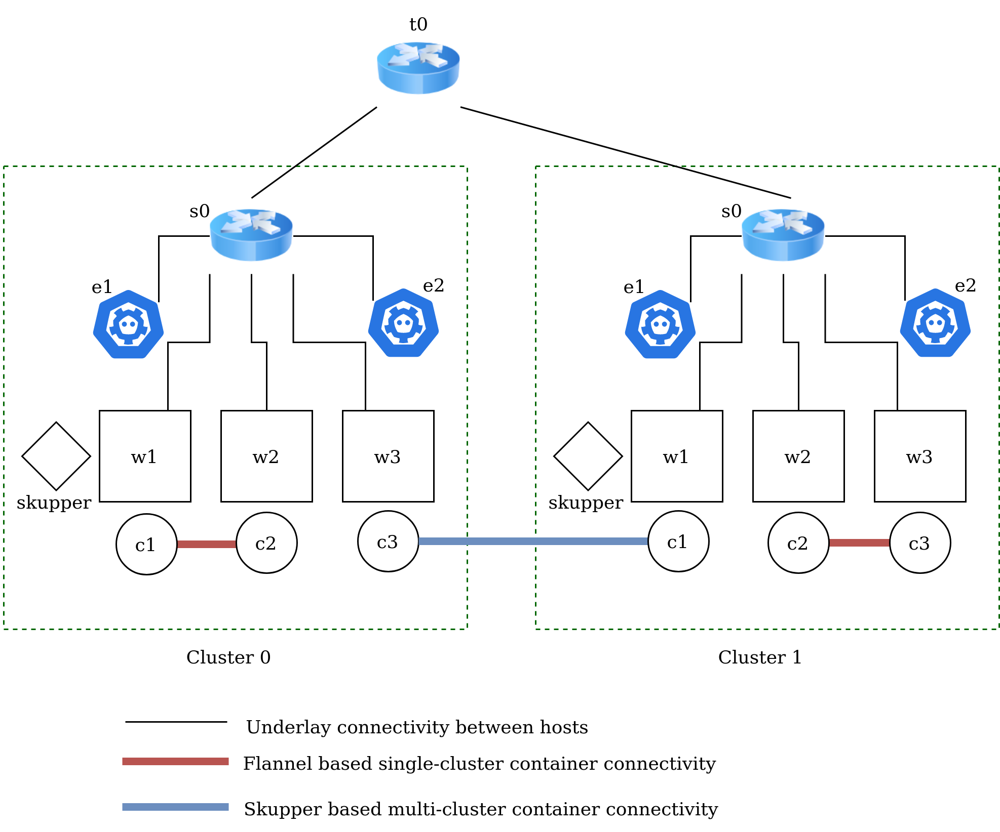
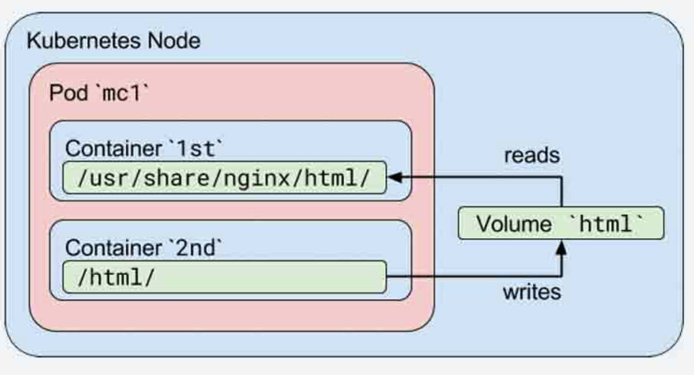

# Cloud Native Networking

Understand the current cloud networking basics.
Have a hands-on experience with a learning tool focused on Networking aspects of Kubernetes
(and multi-cluster networking using Skupper)

---

## Hands On Learning Tool: What it is not 

1. :exclamation: a real Kubernetes setup
2. :exclamation: a single-node k8s runner like minikube, kind

## Hands On Learning Tool: What it is

1. Mininet based simulation
2. Uses as many real components
3. Models reality as close as possible

---

## Refresher: Containers

+ Application executable packaged with its libraries and dependency
+ No separate guest OS like virtual machines
+ Light-weight and portable
+ Isolation through namespace and cgroups
  + Namespace: isolated view of resources like file system, network resources
  + cgroups: Resource limit per process/container  

---

## What is Kubernetes?

+ Docker: Single machine container deployment
+ Kubernetes: Container Orchestration 
  + Across a cluster of machines
  + Manage automated deployment, scaling

---

## Aside: Kubernetes is a Complex Beast

+ Many (many) layers and pieces
+ Continuously evolving
+ Huge ecosystem: hundreds of competing startups, open-source projects, products
+ TODO add figure

---

## What is the deal with Kubernetes networking?

1. Connect containers running on different workers 
2. Load balance multiple replicas as a single service
3. Expose services by name
4. App net features such as: rate limiting, health checks, blue-green testing

Now, do this across multiple clusters :scream:

---

## Aside: Reality of multi-cluster deployments

Most organization workloads are spanning multiple clusters now.
This is still an unsolved problem!

---

# Rest of the deck is organized as follows

1. Introduce a Kubernetes networking concept
2. Discuss how it works in reality
3. Discuss how we run it in *knetsim*
4. Hands on!

---

# Structure

1. Workers and containers :arrow_left:
2. Container-Container communication
3. Service abstraction
4. Multi-cluster communication

---
<!-- footer: C1/4: Workers and Containers, Section A: **Introduction** -->

# C1: Workers and containers

Kubernetes clusters consist of workers, each running containers


---
<!-- footer: C1/4: Workers and Containers, Section B: **How does it work in reality?** -->

# C1: How does it work?

1. Each worker is setup with a `kubelet` component that manages containers
2. Containers are run using a runtime, like `containerd` or `docker`


---
<!-- footer: C1/4: Workers and Containers, Section C: **How do we do it?** -->

# C1: How do we do it?

1. We use mininet `hosts` to represent each worker.
2. We run network namespaces to represent each container.

---

# Aside: what are namespaces?

TODO: can we expand it earlier instead

Note: easy to play with network namespaces using the `ip netns` command.

---

# Aside: mininet

+ Network Emulator
+ Network of virtual hosts, switch, links on a machine

---
<!-- footer: C1/4: Workers and Containers, Section D: **Hands on** -->

# C1: Hands on

Build the image:
```
sudo docker build -t knetsim -f ./Dockerfile .
```

Run the simulator:
```
docker run -it --privileged --rm knetsim
```

---

## Verify if everything is working

```
*** Creating network
...
<ping commands>
*** Starting CLI:
mininet> 
```

---

## Workers 



+ We have 2 clusters with 3 workers each:
+ `C0w1`, `C0w2` and `C0w3` are workers => mininet hosts

Run commands on workers:
```
mininet> C0w1 ifconfig
```
---

## Exercise :hammer:

1. Ping the workers from each other.

---

## Containers

1. Each worker `w<i>` has a container `c<i>`
2. Exec into containers using this command:

```
mininet> py C0w1.exec_container("c1", "ifconfig")
```

---

## Exercise :hammer:

1. Run a few commands in the container. See that only the network namespace is different from the underlying worker.
2. Create new containers:
```
mininet> py C0w1.create_container("c4")
```
(ignore the error it throws)
3. Delete the new container:
```
mininet> py C0w1.delete_container("c4")
```

---
<!-- footer: Reorientation: end of chapter 1 -->

# Progress so far

1. Workers and containers :heavy_check_mark:
2. Container-Container communication :arrow_left:
3. Service abstraction
4. Multi-cluster communication

---
<!-- footer: C2/4: Container-Container, Section A: **Introduction** -->

## C2: Container-container communication

TODO
1. Aside: pods vs containers
   + Pod: Application specific logical host.
     group of containers with shared storage and network resources. 
2. Show example of pods communicating using real k8s example
3. Talk about needs: interface/ip has to be assigned, packets should be routed from one container to another


---
<!-- footer: C2/4: Container-Container, Section B: **How does it work in reality?** -->

## C2: How does it work?

TODO
1. Talk about communication between 2 containers on the same host
2. Talk about communication between 2 containers on different workers: how does flannel, calico, ovn etc do it.
3. Talk about what is common to these: CNI interface
4. Details of CNI interface

---
<!-- footer: C2/4: Container-Container, Section C: **How do we do it?** -->

## C2: How do we do it?

TODO
We run a real CNI plugin - flannel.
Talk about details of how flannel works

---
<!-- footer: C2/4: Container-Container, Section D: **Hands on** -->

## C2: Hands on :hammer:

1. Examine IPs of w1c1 and w2c2.
2. Ping w2c2 from w1c1. Note: use the `ping <ip> -c 5` command.
3. (Optional) Create a new container on one of the workers and see the IP assigned to it and check if you can connect to it.

---

## C2: Hands on

TODO
1. Add diagram of the traffic flow from c1 to c2.
2. Examine these hook points using some commands.

---

## C2: Optional Exercises

1. Examine the logs of flannel in the `/tmp/knetsim` folder.
2. Change the parameters of the flannel config in `conf` folder and re-run and see the change in IPs.

---
<!-- footer: Reorientation: end of chapter 2 -->

# Progress so far

1. Workers and containers :heavy_check_mark:
2. Container-Container communication :heavy_check_mark:
3. Service abstraction :arrow_left:
4. Multi-cluster communication

---
<!-- footer: C3/4: Services, Section A: **Introduction** -->

## C3: Service Abstraction

Users consume services, not pods
We already know about pod ips, how do services work?


---
<!-- footer: C3/4: Services, Section B: **How does it work in reality?** -->

## Services: using DNS


---

## Services: using kube-proxy


---
<!-- footer: C3/4: Services, Section C: **How do we do it?** -->

## C3: How do we do it?

Using nftables

---

## Aside: nftables

+ nftables is the replacement to iptables

---
<!-- footer: C3/4: Services, Section D: **Hands on** -->

## C3: Hands on

In the code, we have:
```
C0.kp_vip_add("100.64.10.1", ["c2", "c3"])
```

This means, we can access the containers c2 and c3 using this VIP.

1. Ping this virtual ip from c1 and see that it works.
2. Delete one of the 2 containers c2/c3 and see what happens. (Hint: repeat the ping a few times)

---

## C3: Exercises :hammer:

1. Create a few containers and expose them using a new VIP.
2. Examine the `nft` rules added to the hosts.

---
<!-- footer: Reorientation: end of chapter 3 -->

# Progress so far

1. Workers and containers :heavy_check_mark:
2. Container-Container communication :heavy_check_mark:
3. Service abstraction :heavy_check_mark:
4. Multi-cluster communication :arrow_left:

---
<!-- footer: C4/4: Multi-cluster, Section A: **Introduction** -->

## C4: Multi-cluster communication

TODO
1. Talk about naive way of exposing services: routes/ingress, single service exposure
2. Talk about why this won't work for generic interaction of many microservices

---
<!-- footer: C4/4: Multi-cluster, Section B: **How does it work in reality?** -->

## C4: How does it work?

TODO
1. Talk about how different solutions exist: submariner, skupper, palmetto?
2. Go into details of skupper - things like the cli command interface to link sites and expose services, the components such as skupper router etc

---
<!-- footer: C4/4: Multi-cluster, Section C: **How do we do it?** -->

## C4: How do we do it?

We also use skupper-router, with manual configuration.

TODO
1. Go into details about skupper router and the config file.

---
<!-- footer: C4/4: Multi-cluster, Section D: **Hands on** -->

## C4: Hands on

Go read line number 79-94 in `main.py`.

Understand and reproduce it.

---

# Retrospective

TODO
1. Talk about what we have seen today.
2. Talk about next steps.
